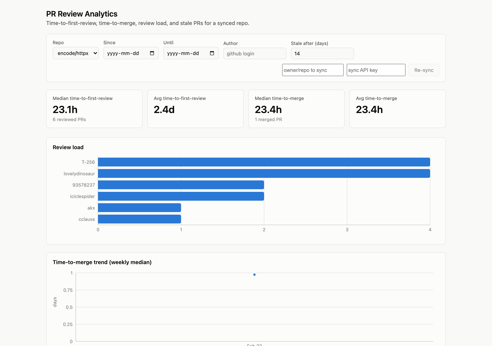

# PR Review Analytics

Turns a GitHub repo's PR history into the metrics an engineering team actually cares about: how long reviews take, who's carrying the review load, which PRs have stalled, and whether review relationships are one-sided.

**Live:** [pr-review-dashboard.fly.dev](https://pr-review-dashboard.fly.dev) · **API:** [pr-review-api.fly.dev](https://pr-review-api.fly.dev)

(Apps sleep when idle on Fly's free tier, so the first load can take a few seconds.)



## Features

- Time-to-first-review and time-to-merge: median and average, with trend sparklines
- Review load per person, so it's obvious who's reviewing everything and who's never asked
- Stale PR detection with a configurable idle threshold
- Review reciprocity: flags it when one person always reviews another's PRs and it never goes the other way
- Filter by date range or author; sync any repo on demand and it stays current on its own afterward
- Log in with GitHub to sync under your own account and rate limit instead of a shared key

## Notes on how it's built

Incremental sync goes through GitHub's GraphQL `search` API instead of `repository.pullRequests`, because the latter has no `updated_at` filter. `search` supports `updated:>=`, so a stored cursor per repo means only PRs that actually changed get re-pulled after the first backfill.

Metrics are plain SQL against Postgres — window functions, correlated subqueries — computed live per request. No cache layer, no pandas step in between.

Bots get flagged at ingestion time from GitHub's `__typename`, so review-load and reciprocity numbers don't get skewed by CI accounts. Draft PRs are left out of time-to-first-review, since GitHub doesn't expose a `readyForReviewAt` field to correct the clock for them.

`POST /sync` is the only endpoint that spends real API quota and database storage, so it's the only one that requires auth (an API key or a logged-in session, either works) and it fails closed if neither is present. Everything else — the metrics themselves — is public. The frontend asks for the key at request time rather than baking it into the build, since a static site's bundle is public no matter how well you think you hid something in it.

Sessions live in a signed, encrypted cookie rather than a database table. Both Fly apps run two machines, and a cookie works the same no matter which one handles a given request, so there's nothing to keep in sync between them. When someone's logged in, their sync uses their own GitHub token instead of the shared one.

Trend deltas on the stat tiles compare two halves of the result set rather than week over week. With a couple of PRs a week, a calendar comparison is mostly sampling noise wearing a trend's clothes — the first version of this showed a 195% swing that turned out to be one PR. Splitting the data in half and requiring a minimum sample size fixed it.

## Stack

| | |
|---|---|
| Backend | FastAPI · SQLAlchemy · PostgreSQL ([Neon](https://neon.tech)) · APScheduler |
| Frontend | React · TypeScript · Vite · Recharts |
| Ingestion | GitHub GraphQL API via `httpx` |
| Auth | GitHub OAuth, signed/encrypted session cookies (`itsdangerous`, `cryptography`) |
| Testing | pytest, `respx` for mocked GitHub responses |
| Deploy | Docker on [Fly.io](https://fly.io), GitHub Actions CI |

## Testing

Most of the value is in the edge cases: PRs with zero reviews, bot accounts, draft PRs, PRs closed without merging, reopened PRs. All mocked against GraphQL fixtures rather than the live API, so the suite runs in under a second with no network or database needed.

```bash
pytest   # in-memory SQLite, nothing external required
```

## Running locally

**Backend**
```bash
cd backend
python3 -m venv ../.venv && source ../.venv/bin/activate
pip install -r requirements-dev.txt
cp .env.example .env   # GITHUB_TOKEN, DATABASE_URL, SYNC_API_KEY, SESSION_SECRET_KEY, SESSION_ENCRYPTION_KEY
uvicorn app.main:app --reload
```

GitHub OAuth needs real HTTPS (the session cookie is `SameSite=None; Secure`, and browsers only honor that over HTTPS), so the login flow only works end to end against the deployed instance. Locally, sync with `SYNC_API_KEY` instead.

**Frontend**
```bash
cd frontend
npm install
cp .env.example .env
npm run dev   # http://localhost:5173
```

## API

| Endpoint | Notes |
|---|---|
| `GET /repos` | Repos synced so far |
| `POST /sync/{owner}/{repo}` | Trigger an incremental sync — requires `X-API-Key` |
| `GET /metrics/{owner}/{repo}/time-to-first-review` | `?since=&until=&author=` |
| `GET /metrics/{owner}/{repo}/time-to-merge` | `?since=&until=&author=` |
| `GET /metrics/{owner}/{repo}/review-load` | `?since=&until=` |
| `GET /metrics/{owner}/{repo}/stale-prs` | `?stale_days=14` |
| `GET /metrics/{owner}/{repo}/review-reciprocity` | `?min_interactions=2` |
| `GET /auth/github/login` | Starts the OAuth handshake — `?return_to=` |
| `GET /auth/github/callback` | OAuth redirect target, not called directly |
| `GET /auth/me` | `{"github_login": "..." \| null}` |
| `POST /auth/logout` | Clears the session |

## Deployment

Two Fly.io apps (backend, plus a static frontend build behind nginx) and a Neon Postgres instance. Walkthrough in [DEPLOY.md](DEPLOY.md).

## What's next

Rate-limit backoff on the GitHub client for repos big enough to hit it, and a metric that actually uses the commit data now that it's ingested — time from first commit to PR open, maybe, or commit count as a churn signal.
